## {background-image="img/slide02_img03.png" background-size="contain" background-color="#111111"}

:::: {.columns}
::: {.column width="55%"}
<!-- map occupies the left -->
:::
::: {.column width="45%" style="background:rgba(0,0,0,0.55); padding:0.8em 1em; border-radius:6px;"}
 

<h2 style="color:white; border-bottom:2px solid rgba(200,164,21,0.7); padding-bottom:0.15em; margin-bottom:0.4em;">Colombia is an incredibly diverse country</h2>

::: {style="color:white; font-size:0.9em; margin-top:0.5em;"}
From tropical beaches to Andean peaks, from the Amazon rainforest to Caribbean islands, all within one country.
:::
:::
::::

## Geography {.dark-text background-image="img/slide03_img06.png" background-size="contain" background-position="left center" background-color="#f8f8f8"}

:::: {.columns}
::: {.column width="55%"}

:::

::: {.column .dark-text width="45%"}
**Six very different natural regions**

- Caribbean Region
- Pacific Region
- Andean Region *(incl. Bogotá)*
- Orinoquía Region
- Amazon Region
- Insular Region
:::
::::

## One of the most biodiverse countries on Earth {background-image="img/slide04_collage.jpg" background-size="cover" background-opacity="0.55" background-color="#0d1f13"}

::: {style="color:rgba(255,255,255,0.82); text-align:center; margin-top:0.3em;"}
*Most biodiverse per km²: more species relative to its size than any other country* · 
[Explore the National Parks ↗](http://www.parquesnacionales.gov.co/portal/en/){target="_blank"}
:::

## Biodiversity stats {background-color="#ffffff"}

:::: {.columns}
::: {.column width="50%"}

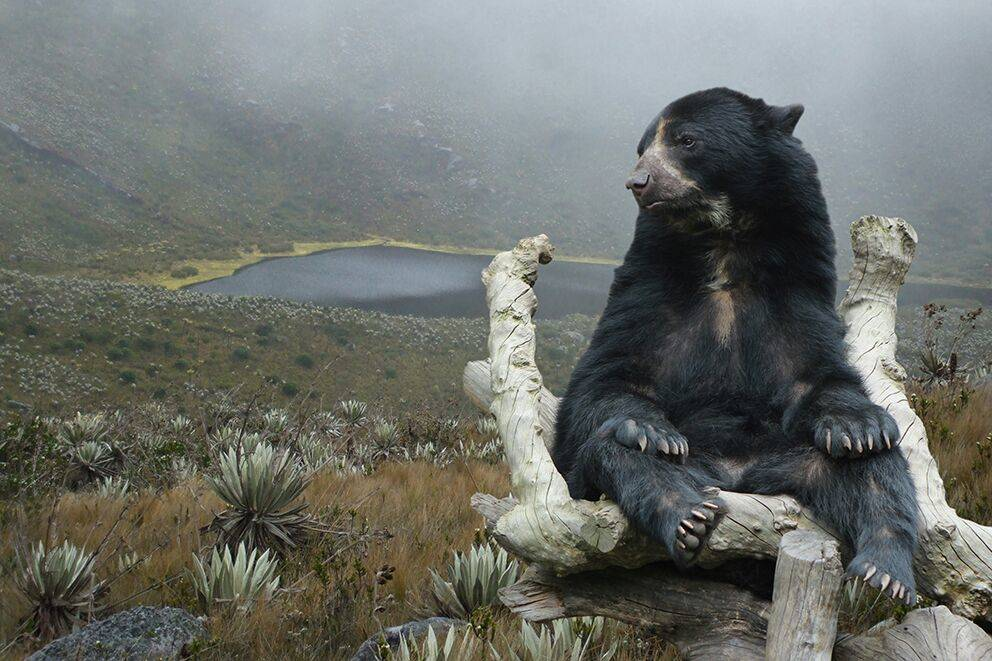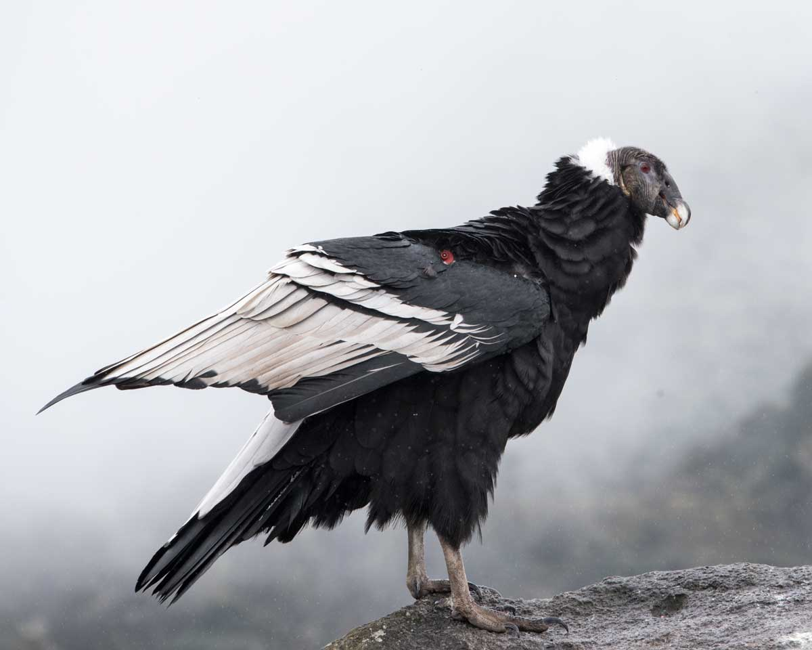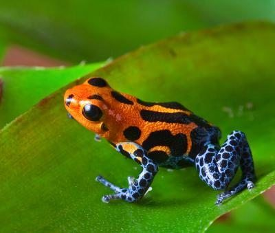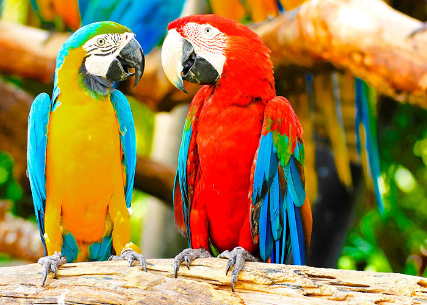

:::
::: {.column width="50%"}

[Check live stats ↗](https://cifras.biodiversidad.co/){target="_blank"}

::: {style="font-size:1.2em; font-weight:bold; color:#1a5c2a; margin: 0.2em 0 0.5em 0;"}
51,330 species
:::

::: {.bio-rank}
[**🥇 First in**]{.rank-label}  
Birds · Orchids

[**🥈 Second in**]{.rank-label}  
Plants · Amphibians · Butterflies · Freshwater fish

[**🥉 Third in**]{.rank-label}  
Palms · Reptiles

[**4th in**]{.rank-label}  
Mammals
:::
:::
::::

## Huge cultural diversity {background-image="img/slide06_img02.jpg" background-opacity="0.45" background-color="#111"}

:::: {.columns}
::: {.column width="50%"}
<!-- photo on the left -->
:::
::: {.column width="50%"}
::: {style="color:white;"}

A different mix of Native American, European, and African ancestry in each region.

::: {style="margin-top:1em;"}
[Colombia: a multi-ethnic and multicultural country ↗](https://colombia.co/en/colombia-country/colombia-culture/music/colombia-multi-ethnic-multicultural-country){target="_blank"}
:::
:::
:::
::::

## Cultural diversity: music as an example {background-image="img/slide07_img00.jpg" background-opacity="0.4" background-color="#0d0d0d"}
::: {style="color:white; font-size:0.72em; margin-bottom:0.6em;"}
Colombia is known as *"The Land of a Thousand Rhythms"* (in fact it has over **1,025** folkloric rhythms).
:::
:::: {.columns}
::: {.column width="48%"}
::: {.music-link style="color:white;"}
[**Caribbean**]{style="color:#c8a415; font-size:0.85em; text-transform:uppercase; letter-spacing:0.08em;"}  
· [🎵 Totó La Momposina — El Pescador](https://youtu.be/3wN5YcDTx0Y){target="_blank"} *(traditional)*  
· [🎵 Systema Solar — Yo Voy Ganao](https://youtu.be/I9t4XTOwtEo){target="_blank"} *(modern)*

[**Pacific**]{style="color:#c8a415; font-size:0.85em; text-transform:uppercase; letter-spacing:0.08em;"}  
· [🎵 Herencia de Timbiquí — Amanece](https://youtu.be/BuBrF_npl_g){target="_blank"} *(traditional)*  
· [🎵 ChocQuibTown — De Donde Vengo Yo](https://youtu.be/yMS4J6Gp6e4){target="_blank"} *(modern)*

[**Andean**]{style="color:#c8a415; font-size:0.85em; text-transform:uppercase; letter-spacing:0.08em;"}  
· [🎵 Fulgencio García — La gata golosa](https://youtu.be/rA-vUpaMUhU){target="_blank"} *(traditional)*  
· [🎵 Monsieur Periné — Lloré](https://youtu.be/YiJ2YSxLYpg){target="_blank"} *(modern)*  
· [🎵 Aterciopelados — Rompecabezas](https://youtu.be/Awj4yFXUmUc){target="_blank"} *(modern)*
:::
:::
::: {.column width="4%"}
:::
::: {.column width="48%"}
::: {.music-link style="color:white;"}
[**Orinoquía**]{style="color:#c8a415; font-size:0.85em; text-transform:uppercase; letter-spacing:0.08em;"}  
· [🎵 Cholo Valderrama — Llanero Si Soy Llanero](https://youtu.be/FZoMdjH0FdE){target="_blank"} *(traditional)*

[**Amazon**]{style="color:#c8a415; font-size:0.85em; text-transform:uppercase; letter-spacing:0.08em;"}  
· [🎵 Indio Cuper — Tonada Amazonica](https://youtu.be/vV4n2q8764w){target="_blank"} *(traditional)*

[**Insular**]{style="color:#c8a415; font-size:0.85em; text-transform:uppercase; letter-spacing:0.08em;"}  
· [🎵 Coral Group — Coconut Woman](https://youtu.be/S18HEazgxeo){target="_blank"} *(traditional)*
:::
::: {style="margin-top:1.5em; font-size:0.7em; color:rgba(255,255,255,0.8);"}
[▶ 9-min documentary on Colombian traditional music](https://www.youtube.com/watch?v=oRL44KZXuvE){target="_blank"}
:::
:::
::::

## {background-color="#0d0d0d"}

::: {style="color:#c8a415; font-size:0.7em; text-transform:uppercase; letter-spacing:0.1em; margin-bottom:0.6em;"}
**A taste — click to play**
:::

:::: {.columns}
::: {.column width="50%"}
::: {style="color:rgba(255,255,255,0.75); font-size:0.65em; text-transform:uppercase; letter-spacing:0.08em; margin-bottom:0.3em;"}
Traditional · Caribbean
:::
<iframe width="100%" height="215"
  src="https://www.youtube.com/embed/3wN5YcDTx0Y?rel=0&modestbranding=1"
  title="Totó La Momposina — El Pescador"
  frameborder="0"
  allow="accelerometer; autoplay; clipboard-write; encrypted-media; gyroscope; picture-in-picture"
  allowfullscreen>
</iframe>
::: {style="color:rgba(255,255,255,0.6); font-size:0.62em; margin-top:0.3em;"}
Totó La Momposina — *El Pescador*
:::
:::
::: {.column width="4%"}
:::
::: {.column width="46%"}
::: {style="color:rgba(255,255,255,0.75); font-size:0.65em; text-transform:uppercase; letter-spacing:0.08em; margin-bottom:0.3em;"}
Modern · Andean
:::
<iframe width="100%" height="215"
  src="https://www.youtube.com/embed/YiJ2YSxLYpg?rel=0&modestbranding=1"
  title="Monsieur Periné — Lloré"
  frameborder="0"
  allow="accelerometer; autoplay; clipboard-write; encrypted-media; gyroscope; picture-in-picture"
  allowfullscreen>
</iframe>
::: {style="color:rgba(255,255,255,0.6); font-size:0.62em; margin-top:0.3em;"}
Monsieur Periné — *Lloré*
:::
:::
::::

::: {style="color:rgba(255,255,255,0.4); font-size:0.58em; margin-top:0.8em; text-align:right;"}
All regional examples linked in the previous slide
:::

## Safety: the honest picture {background-image="img/slide08_img01.jpg" background-opacity="0.45" background-color="#111"}

:::: {.columns}
::: {.column width="56%" style="color:white; font-size:0.82em;"}
- Crime has fallen dramatically since the 1990s; tourism grew 34% between 2019 and 2023
- US State Dept issues a Level 3 advisory, but this covers the entire country, including remote border/jungle zones you would never visit
- The flagged high-risk areas (Venezuelan border, Norte de Santander, parts of Cauca) are not on any conference itinerary
- Like any big city, Bogotá has neighbourhoods to avoid, but the conference venue area (Chicó Norte) is one of the city's safest and best-patrolled zones
:::
::: {.column width="44%"}
::: {.pull-quote style="background:rgba(200,164,21,0.15);"}
*"Every travel advisory distinguishes between tourist zones and border/rural conflict zones. Major tourist destinations like Bogotá, Cartagena, and Tayrona are not in the restricted zones."*

::: {style="font-size:0.7em; margin-top:0.5em; color:rgba(255,255,255,0.7);"}
[The Good Traveler Colombia, 2026](https://elbuenviajero.com/blog/is-colombia-safe/){target="_blank"}
:::
:::
:::
::::

## Safety: the conference itinerary {background-image="img/slide08_img01.jpg" background-opacity="0.45" background-color="#111"}

<h3 style="color:white; text-align:center; font-size:0.9em; border-bottom:1px solid rgba(200,164,21,0.4); padding-bottom:0.2em; margin-bottom:0.6em;">Our specific destinations</h3>

:::: {.columns}
::: {.column width="33%"}
::: {style="background:rgba(255,255,255,0.08); border-radius:8px; padding:0.8em; text-align:center;"}
::: {style="font-size:1.5em; margin-bottom:0.3em;"}
🏙️
:::
::: {style="color:#c8a415; font-weight:bold; font-size:0.82em; margin-bottom:0.4em;"}
Bogotá — Chicó Norte
:::
::: {style="font-size:0.75em; color:white; text-align:left;"}
One of the safest residential and commercial areas in the city. Well-lit, walkable, full of restaurants and hotels. Used daily by locals and expats alike.
:::
:::
:::
::: {.column width="33%"}
::: {style="background:rgba(255,255,255,0.08); border-radius:8px; padding:0.8em; text-align:center;"}
::: {style="font-size:1.5em; margin-bottom:0.3em;"}
🏰
:::
::: {style="color:#c8a415; font-weight:bold; font-size:0.82em; margin-bottom:0.4em;"}
Cartagena
:::
::: {style="font-size:0.75em; color:white; text-align:left;"}
The walled old city is one of the most visited and safest tourist zones in South America. Standard urban precautions apply.
:::
:::
:::
::: {.column width="33%"}
::: {style="background:rgba(255,255,255,0.08); border-radius:8px; padding:0.8em; text-align:center;"}
::: {style="font-size:1.5em; margin-bottom:0.3em;"}
🌿
:::
::: {style="color:#c8a415; font-weight:bold; font-size:0.82em; margin-bottom:0.4em;"}
Tayrona National Park
:::
::: {style="font-size:0.75em; color:white; text-align:left;"}
A world-class natural reserve. Note it has scheduled bi-annual closures (check 2027 dates). Reopened March 2026 after a temporary extended closure; situation has normalised.
:::
:::
:::
::::

::: {style="font-size:0.65em; color:rgba(255,255,255,0.5); margin-top:0.7em; text-align:center;"}
Further reading: [Is Colombia safe in 2026? — The Good Traveler Colombia](https://elbuenviajero.com/blog/is-colombia-safe/){target="_blank"} · Colombia safety overview — Impulse Travel · Colombia safety stats — Travel Noire
:::

## Bogotá {background-image="img/slide10_img02.jpg" background-opacity="0.45" background-color="#0a0f14"}

:::: {.columns}
::: {.column width="50%"}
<!-- aerial photo on the left -->
:::
::: {.column width="50%"}
::: {style="color:white;"}

Colombia's **capital and largest city**, founded in 1538.

- **Population:** 7M+ (10M+ metro area)
- **Region:** Andean
- **Elevation:** 2,640 m (8,660 ft)
- **Temperature:** avg 14.5 °C (58 °F),  
  ranging 6–19 °C (43–66 °F)

::: {style="margin-top:0.8em; font-size:0.8em;"}
[Wikipedia ↗](https://en.wikipedia.org/wiki/Bogot%C3%A1){target="_blank"}
:::
:::
:::
::::

## Bogotá: well connected {background-color="#0a0f14"}

:::: {.columns}
::: {.column width="65%"}
<iframe src="bog_map.html" width="100%" height="480px" style="border:none; border-radius:6px;"></iframe>
::: {style="font-size:0.6em; color:rgba(255,255,255,0.45); margin-top:0.3em; text-align:center;"}
🖱️ Interactive map — hover over a point to see city and flight details · click, drag, and zoom to explore
:::
:::
::: {.column width="35%"}

<h2 style="color:white; border-bottom-color:rgba(200,164,21,0.7);">Bogotá</h2>

**103 destinations** in **30 countries**, non-stop from El Dorado (BOG).

44 domestic routes plus direct connections across Europe, the Americas, and the Middle East.

::: {style="font-size:0.65em; margin-top:1em; color:rgba(255,255,255,0.5);"}
Source: [FlightConnections, 2026](https://www.flightconnections.com/flights-from-bogot%C3%A1-bog){target="_blank"}
:::
:::
::::

## Bogotá: no visa required for most attendees {background-color="#0a0f14"}

:::: {.columns}
::: {.column width="55%"}

::: {style="background:rgba(255,255,255,0.08); border-radius:8px; padding:0.8em; grid-column: span 2;"}
::: {style="color:#c8a415; font-weight:bold; font-size:0.8em; margin-bottom:0.3em;"}
🌎 Latin America
:::
::: {style="color:white; font-size:0.75em;"}
No visa required for most countries: Bogotá is a natural hub for regional attendees
:::
:::

::: {style="display:grid; grid-template-columns:1fr 1fr; gap:0.7em; margin-top:0.7em;"}

::: {style="background:rgba(255,255,255,0.08); border-radius:8px; padding:0.8em;"}
::: {style="color:#c8a415; font-weight:bold; font-size:0.8em; margin-bottom:0.3em;"}
🇪🇺 European Union / Schengen
:::
::: {style="color:white; font-size:0.75em;"}
No visa required · stamp on arrival
:::
:::

::: {style="background:rgba(255,255,255,0.08); border-radius:8px; padding:0.8em;"}
::: {style="color:#c8a415; font-weight:bold; font-size:0.8em; margin-bottom:0.3em;"}
🇬🇧 🇺🇸 🇨🇦 🇦🇺 UK · USA · Canada · Australia
:::
::: {style="color:white; font-size:0.75em;"}
No visa required · stamp on arrival
:::
:::

:::

:::
::: {.column width="45%"}
::: {style="color:white; padding-left:0.5em;"}

 

Colombia's open visa policy covers the **vast majority of potential ISHE attendees**  from Latin America, North America, and Europe.

::: {style="margin-top:0.8em; background:rgba(200,164,21,0.12); border-radius:6px; padding:0.6em; font-size:0.78em; color:rgba(255,255,255,0.85);"}
Up to **90 days** per stay (extendable to 180 days/year). No advance paperwork required.
:::

::: {style="margin-top:0.8em; font-size:0.65em; color:rgba(255,255,255,0.5);"}
[Colombia visa exemption & requirements ↗](https://embassies.net/colombia-visa-exemption){target="_blank"}
:::

:::
:::
::::

## Bogotá: excellent value {background-color="#0a0f14"}

<h3 style="color:white; text-align:center; font-size:0.85em; border-bottom:1px solid rgba(200,164,21,0.4); padding-bottom:0.2em; margin-bottom:0.7em;">Estimated daily costs — mid-range conference attendee (USD)</h3>

:::: {.columns}
::: {.column width="33%"}
::: {style="background:rgba(200,164,21,0.18); border-radius:8px; padding:1em; text-align:center; border: 1px solid rgba(200,164,21,0.4);"}
::: {style="color:#c8a415; font-weight:bold; font-size:1em; margin-bottom:0.4em;"}
🇨🇴 Bogotá
:::
::: {style="color:white; font-size:0.8em; text-align:left; margin-top:0.5em;"}
🏨 Hotel (3–4★): **$80–120**
🍽️ Restaurant meal: **$12–20**
🚕 City transport: **$3–8**
:::
::: {style="color:#c8a415; font-size:1.2em; font-weight:bold; margin-top:0.6em;"}
~$95–148 / day
:::
:::
:::
::: {.column width="33%"}
::: {style="background:rgba(255,255,255,0.06); border-radius:8px; padding:1em; text-align:center;"}
::: {style="color:rgba(255,255,255,0.7); font-weight:bold; font-size:1em; margin-bottom:0.4em;"}
🇧🇷 São Paulo / Brazil
:::
::: {style="color:rgba(255,255,255,0.65); font-size:0.8em; text-align:left; margin-top:0.5em;"}
🏨 Hotel (3–4★): **$150–220**
🍽️ Restaurant meal: **$20–35**
🚕 City transport: **$5–12**
:::
::: {style="color:rgba(255,255,255,0.6); font-size:1.2em; font-weight:bold; margin-top:0.6em;"}
~$175–267 / day
:::
:::
:::
::: {.column width="33%"}
::: {style="background:rgba(255,255,255,0.06); border-radius:8px; padding:1em; text-align:center;"}
::: {style="color:rgba(255,255,255,0.7); font-weight:bold; font-size:1em; margin-bottom:0.4em;"}
🇨🇱 Santiago / Chile
:::
::: {style="color:rgba(255,255,255,0.65); font-size:0.8em; text-align:left; margin-top:0.5em;"}
🏨 Hotel (3–4★): **$130–190**
🍽️ Restaurant meal: **$18–30**
🚕 City transport: **$4–10**
:::
::: {style="color:rgba(255,255,255,0.6); font-size:1.2em; font-weight:bold; margin-top:0.6em;"}
~$152–230 / day
:::
:::
:::
::::

::: {style="font-size:0.6em; color:rgba(255,255,255,0.4); margin-top:0.8em; text-align:center;"}
Approximate 2025–2026 rates · Sources: Booking.com · Numbeo · local listings
:::

## Bogotá: what the city offers {background-image="img/slide12_img01.jpg" background-opacity="0.45" background-color="#111"}

:::: {.columns}
::: {.column width="50%"}
<!-- city panorama on the left -->
:::
::: {.column width="50%" style="color:white; font-size:0.82em;"}

- **58 museums**, including the world-class Gold Museum
- Wide range of hotels, hostels, and Airbnb
- Vibrant cultural calendar year-round

::: {style="margin-top:0.8em; background:rgba(200,164,21,0.18); border-radius:8px; padding:0.8em; border:1px solid rgba(200,164,21,0.4);"}
::: {style="color:#c8a415; font-weight:bold; font-size:0.85em; margin-bottom:0.3em;"}
🍽️ World-class gastronomy
:::
::: {style="font-size:0.8em; color:white;"}
Home to [**El Chato**](https://www.theworlds50best.com/restaurants/best-in-latin-america/the-list/El-Chato.html){target="_blank"} — **#1 restaurant in Latin America** (World's 50 Best). Hundreds of options at every price point.
:::
:::

::: {.pull-quote style="background:rgba(200,164,21,0.15); margin-top:0.8em;"}
*"Bogotá, Colombia's banging capital"*

::: {style="font-size:0.7em; color:rgba(255,255,255,0.7);"}
[— The Guardian ↗](https://www.theguardian.com/travel/2017/feb/25/bogota-colombia-music-clubs-nightlife){target="_blank"}
:::
:::
:::
::::

# Hosts {background-image="img/slide01_img00.jpg" background-opacity="0.3" background-color="#0d1f13"}

::: {.section-title}
The University and the Lab
:::

## Universidad El Bosque {background-color="#ffffff"}

:::: {.columns}
::: {.column width="50%"}
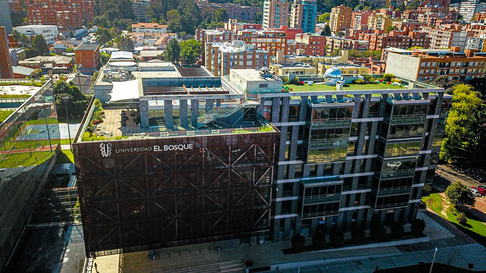
:::
::: {.column width="50%"}

[**Universidad El Bosque** ↗](https://www.unbosque.edu.co/){target="_blank"}

- ~11,000 students
- 31 undergraduate programmes
- 90 postgraduate programmes
- Recognised by the Colombian government as a **High Quality** institution
:::
::::

## The Human Behaviour and Evolution Lab (EvoCo) {background-color="#ffffff"}

:::: {.columns}
::: {.column width="55%"}

The **EvoCo Lab** is one of the few research centres in South America studying human behaviour from an evolutionary perspective.

Research covers a wide range, from mate choice and face and voice perception to hormone research, combining experimental work with computational methods.

EvoCo is part of the **Cognitive Processes and Education Research Group**, recognised at the highest level by the Colombian government.

:::
::: {.column width="45%"}
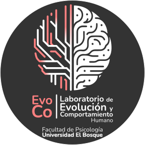
:::
::::

# Plan {background-image="img/slide17_img02.jpg" background-opacity="0.3" background-color="#0d1f13"}

::: {.section-title}
Location, social activities, and pre/post-conference trip
:::

## Location: Chicó Norte {background-image="img/slide17_img02.jpg" background-opacity="0.4" background-color="#111"}

:::: {.columns}
::: {.column width="50%"}
<!-- Chicó Norte photo on the left -->
:::
::: {.column width="50%"}
::: {style="color:white;"}

In a hotel in the **Chicó Norte** area:

- One of the nicest and safest areas in the city
- Lots of restaurants, cafés, bars, and shops within walking distance
- Excellent accommodation options at various price points
- One session (perhaps an afternoon) at the University

::: {style="margin-top:0.8em; font-size:0.85em;"}
**Banquet** on the last evening at a great Bogotá restaurant —  e.g. [Andrés DC ↗](http://www.andrescarnederes.com/en/){target="_blank"}
:::
:::
:::
::::

## Social activities: city centre tour {background-color="#ffffff"}

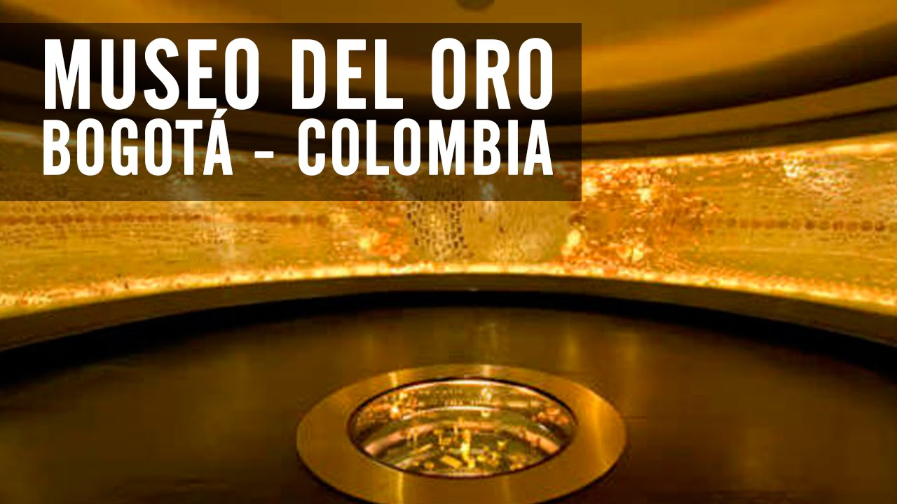
① Gold Museum

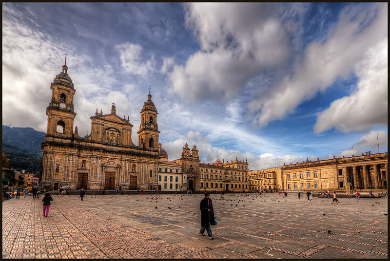
② Plaza de Bolívar

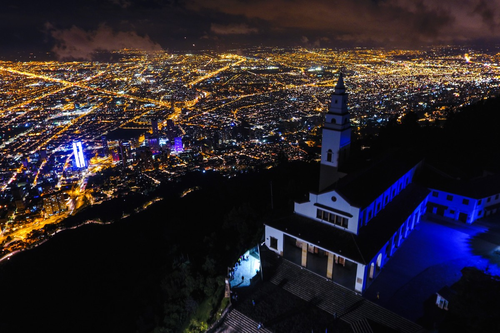
③ Monserrate

One afternoon for a guided trip to the historic city centre:

1. [**Museo del Oro**](https://artsandculture.google.com/partner/museo-del-oro-bogota){target="_blank"} — one of the world's great pre-Columbian collections
2. [**Plaza de Bolívar**](https://en.wikipedia.org/wiki/Plaza_Bol%C3%ADvar,_Bogot%C3%A1){target="_blank"} — the historic heart of the city
3. [**Monserrate**](https://monserrate.co/en/){target="_blank"} — watch the sunset over the city with a coffee at 3,152 m

## Pre/post-conference trip: Caribbean Coast (4–5 days) {background-image="img/slide19_img01.jpg" background-opacity="0.4" background-color="#0d1525"}

:::: {.columns}
::: {.column width="50%"}

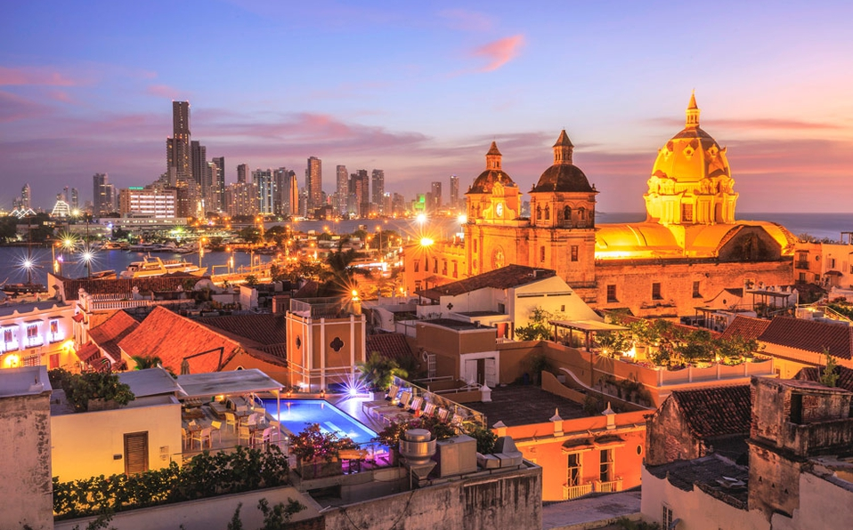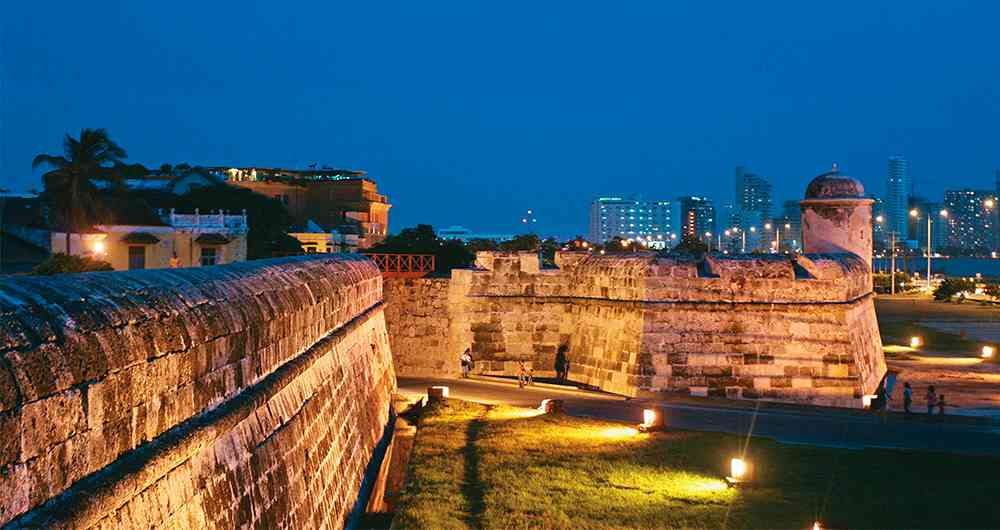

:::
::: {.column width="50%"}
::: {style="color:white;"}

<h3 style="color:white;">First stop: Cartagena de Indias</h3>

A UNESCO World Heritage colonial city on the Caribbean — stunning architecture, warm weather, and superb food.

[Explore Cartagena ↗](https://www.lonelyplanet.com/colombia/caribbean-coast/cartagena){target="_blank"}
:::
:::
::::

## Pre/post-conference trip: Tayrona National Park {background-image="img/slide20_img04.jpg" background-opacity="0.35" background-color="#0d2515"}

:::: {.columns}
::: {.column width="50%"}

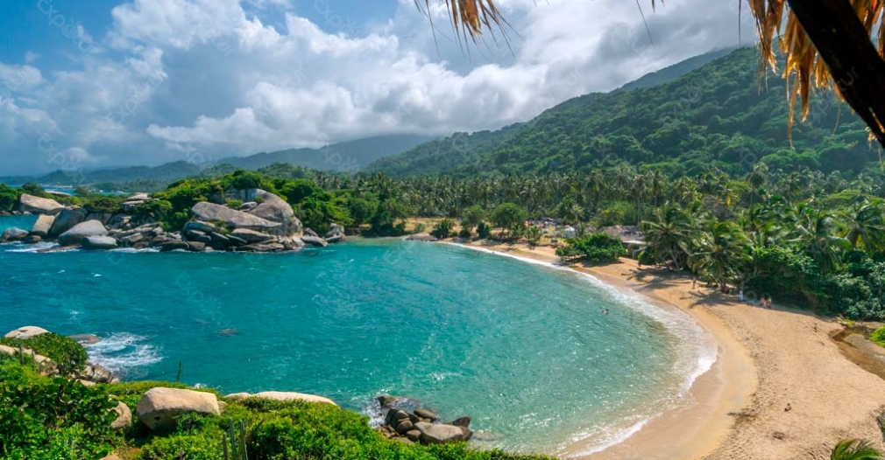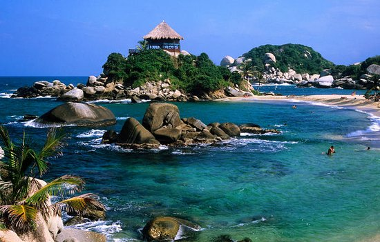

:::
::: {.column width="50%"}
::: {style="color:white;"}

<h3 style="color:white;">Then: Tayrona National Park</h3>

One of Colombia's most spectacular natural reserves — pristine beaches, coral reefs, and jungle trails descending to the Caribbean Sea.

[Explore Tayrona ↗](https://www.lonelyplanet.com/colombia/caribbean-coast/parque-nacional-tayrona){target="_blank"}
:::
:::
::::

## {background-image="img/slide01_img00.jpg" background-opacity="0.5" background-color="#0d1f13"}

::: {style="display:flex; flex-direction:column; justify-content:center; align-items:center; height:100%; text-align:center;"}

::: {style="color:white; font-size:2em; font-family:Georgia,serif; text-shadow:2px 2px 8px rgba(0,0,0,0.9);"}
Bogotá, Colombia
:::

::: {style="color:rgba(200,164,21,0.9); font-size:1em; margin-top:0.5em; text-shadow:1px 1px 4px rgba(0,0,0,0.8); letter-spacing:0.1em; text-transform:uppercase;"}
ISHE Congress 2028
:::

  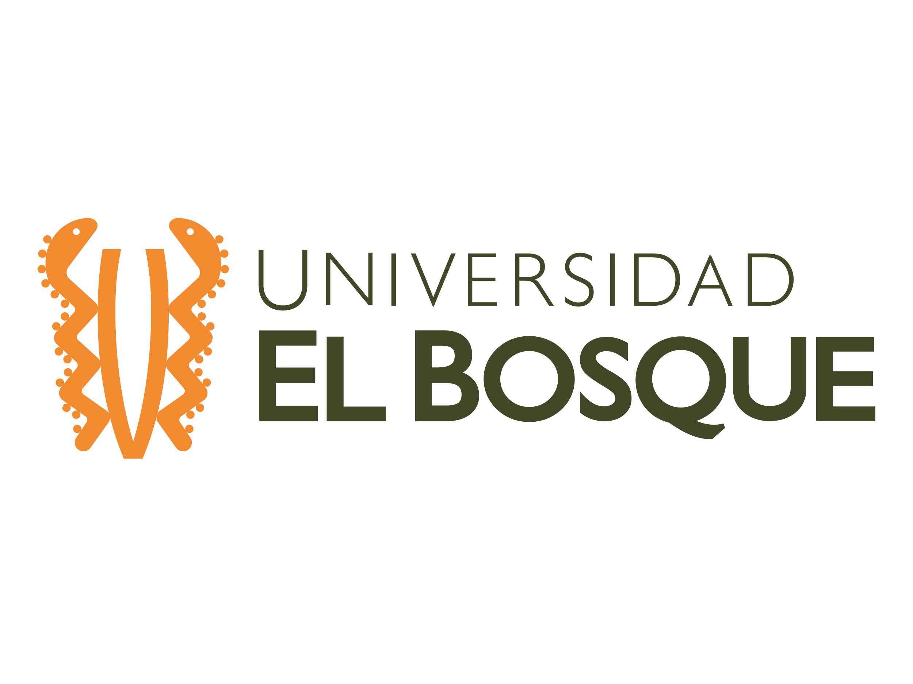

:::
